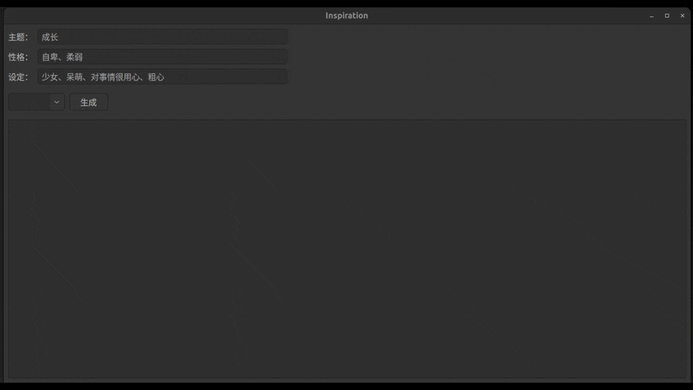

# 创意写作与故事生成工具

## 📖 项目简介

本项目基于 AIGC 技术的创意写作辅助工具, 是  **AIGC期末大作业** 的任务要求

结合 GPT 的 API ，通过 **wxPython** 设计（GUI），用户输入主题、角色性格和设定，生成故事大纲或完整文本

支持上下文关联的连续修改。


## 🛠 安装指南

1. 克隆项目

```
git clone https://github.com/StevenRical/stroy_helper.git
cd stroy_helper
```

2. 配置 Python 环境
```
conda create -n aigc python=3.8.10
conda activate aigc
pip install -r requirements.txt
```

3. 设置 OpenAI API 密钥
    将 OpenAI API 密钥设置为环境变量：
    API 可以用 [GPT_API_free](https://github.com/chatanywhere/GPT_API_free?tab=readme-ov-file) 获取, 不用挂梯方便
```
export OPENAI_API_KEY=your_openai_api_key  # Linux/MacOS
set OPENAI_API_KEY=your_openai_api_key    # Windows
```


## 🚀 使用说明

运行程序：

```
python AIGC/Inspiration.py 
```


## 📷 项目截图




## 🛡 技术栈

编程语言： Python 3.8+
图形界面： wxPython
AI 模型： OpenAI GPT-3.5

